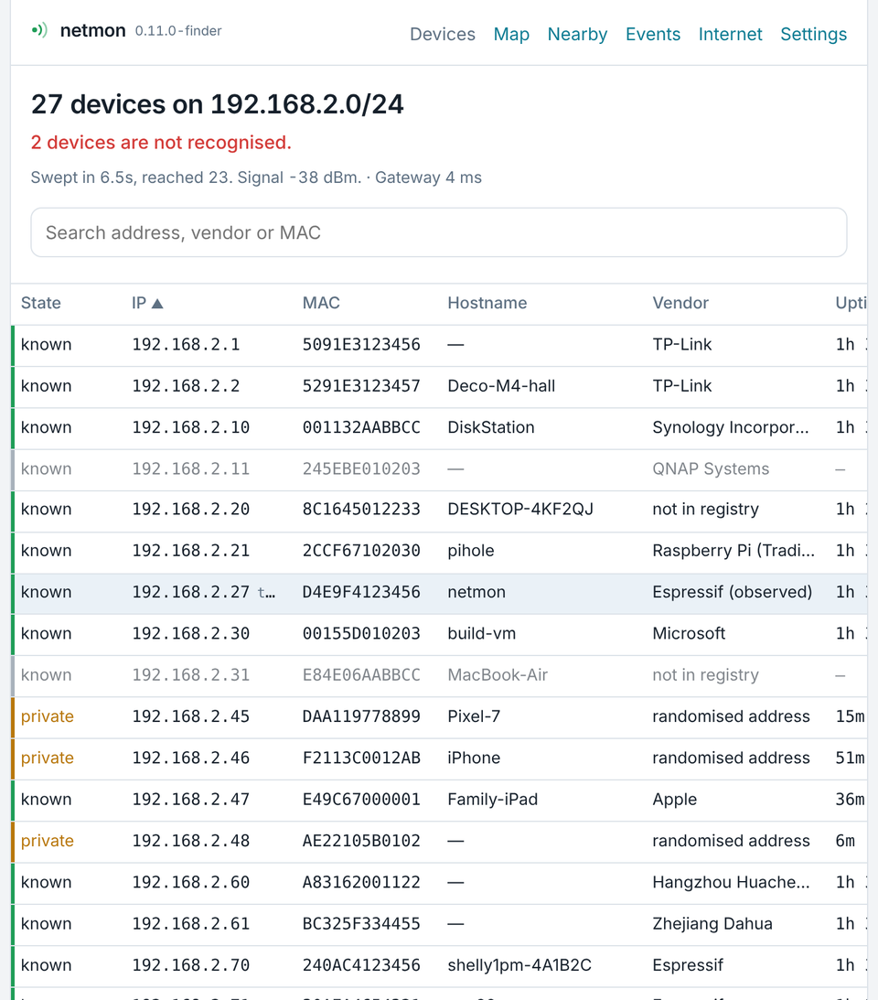
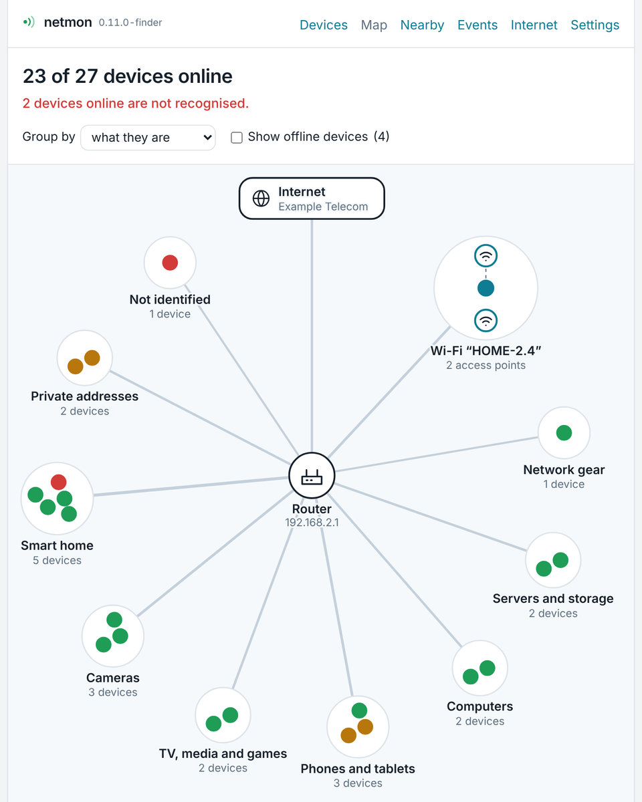
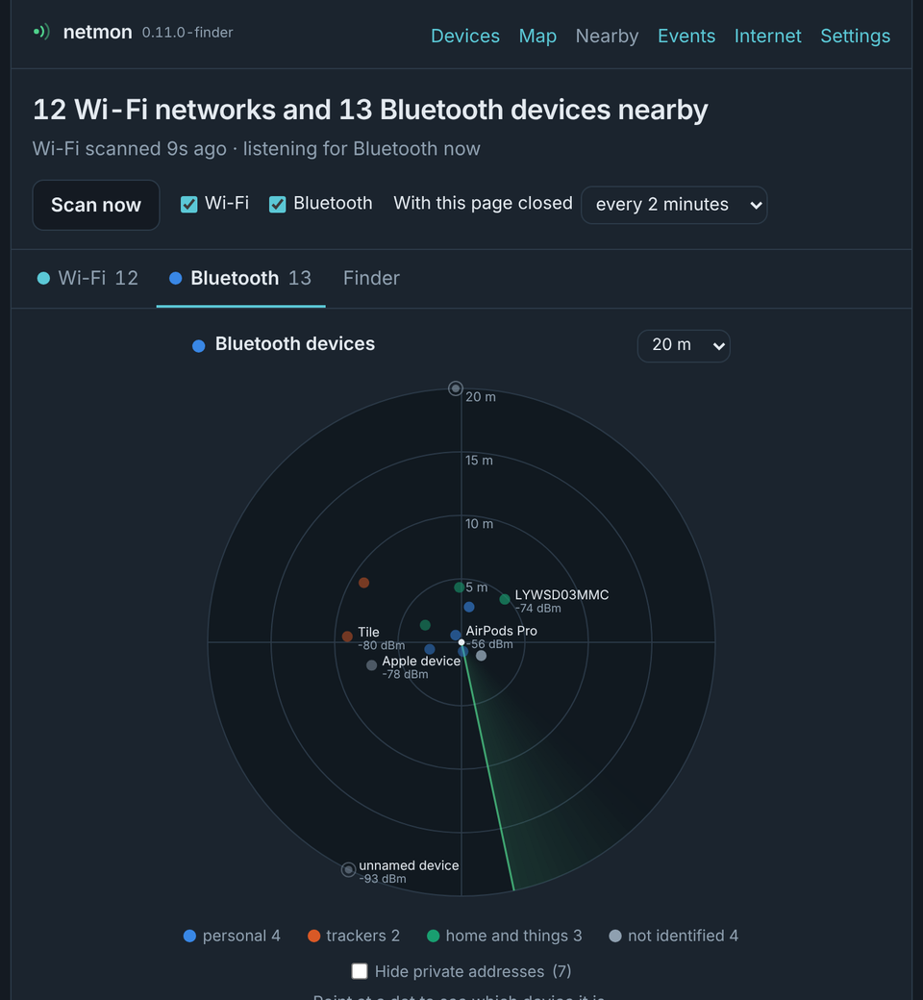
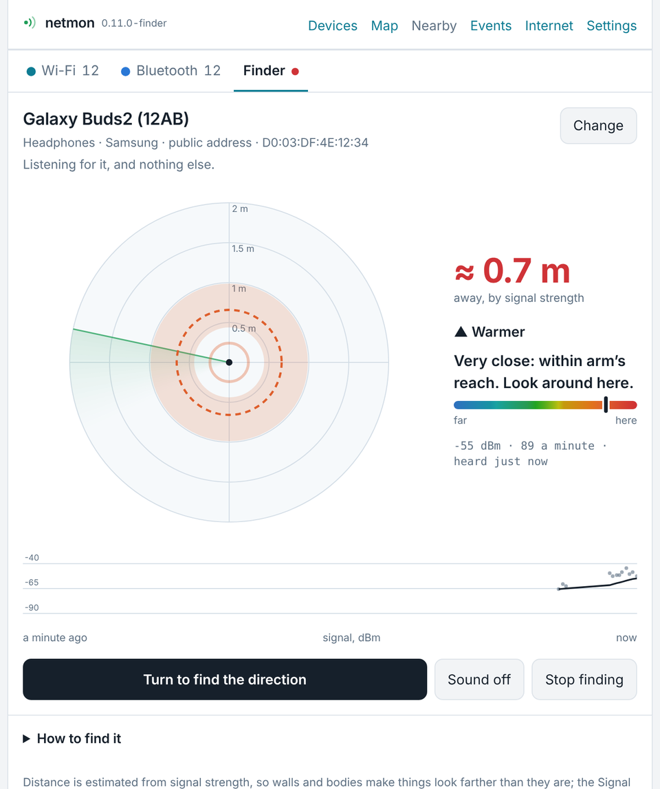

# netmon

A network monitor that runs on one ESP32 board. It finds every device on your
LAN, tells you which ones it doesn't recognise, and scans the Wi-Fi and
Bluetooth around it. You use it through web pages that the board serves
itself, and those pages never load anything from the internet. It keeps a
saved report of each network it has been on, and a paired phone can reach it
over Bluetooth, away from its Wi-Fi. Pages and API ask for a password.

- **Firmware** 0.13.0-login for an ESP32 DevKit V1 (ESP32-WROOM-32, 4 MB flash). It is written in Arduino C++ and needs no extra wiring.
- **Android app** 1.3.0 (optional). It reads the same API, over Wi-Fi or Bluetooth, and has the same Devices, Map, Nearby and Finder screens. It also keeps a longer event history on the phone, sends notifications, browses and exports the saved reports, and can update the firmware.

<table>
  <tr>
    <td></td>
    <td></td>
  </tr>
  <tr>
    <td></td>
    <td></td>
  </tr>
</table>

<sub>Screenshots are from the simulated board in <code>firmware/test/pages</code>. None of the names or addresses are real.</sub>

## What it does

**Devices** (`/`). Once a minute the board sends an ARP sweep across its own
subnet (any size from /16 up), which takes about 6.5 s for a /24. Each device
gets a vendor from its MAC prefix and a hostname from the DHCP broadcasts the
router relays. It also gets one of three states:

| State | Meaning |
|---|---|
| known | On this network's list: seen during its first 10-minute learning window, or marked as known since |
| private | Uses a randomised (locally administered) MAC, as most phones do. Never flagged |
| unknown | Has a manufacturer-assigned MAC and is not on the list. **This is the case worth checking.** |

The list is kept on the board, one per network, so it survives restarts, power
cuts and firmware updates. Pick a device in the table to **Trust** it (it
becomes known and stays known) or **Forget** it (it comes off the list and is
flagged if it turns up again). The page also shows uptime as the board has
seen it, and the time each offline device was last seen.

**Map** (`/map`). Draws your network around the router. Devices are grouped by
what they are (phones, cameras, smart home, servers and so on), going by
their names and makers. Your Wi-Fi access points appear as a group of their own.

**Nearby** (`/nearby`). Has a Wi-Fi radar and a Bluetooth radar with live
arrival and departure logs, signal trends and rough distance estimates. It
also identifies device kinds from Bluetooth advertisements (AirPods, Find My
trackers, Tile, Windows laptops, Flipper Zero and others). The **Finder** tab
helps you walk up to one device, such as a lost tracker. It shows a smoothed
distance and whether you're getting warmer or colder. Turn slowly on the spot
with the board held against your chest and it also gives a direction. In the
Android app the phone follows that turn with its own rotation sensor, and an
arrow keeps pointing the way afterwards.

**Saved reports** (in Settings). For each network the board has been on, up
to four, its device list as it last stood, kept in flash: saved two sweeps
after joining, then every 15 minutes, before every restart and when you ask.
Devices not seen since the board last started are carried over from the
report before, so a power cut doesn't shrink it. Download one as JSON or CSV,
or browse it in the app. See [Saved reports](docs/saved-reports.md).

**Bluetooth.** A phone paired with the board, once, with a 6-digit code from
the Settings page, uses the Android app over Bluetooth whenever the board
doesn't answer on Wi-Fi: within about 10 metres, in setup mode, on another
network. See [Using netmon over Bluetooth](docs/bluetooth.md).

**Events** (`/events`) lists devices that appeared, went offline or came back,
and opens with the **LAN watch**. That notices four things that should not
change on a home network unless somebody changes them:

| Alert | What changed | Looks like |
|---|---|---|
| Router changed | The router's address answers from a different MAC | ARP spoofing, or a replaced router |
| Address clash | Two MACs keep taking turns answering for one address | Two devices on one fixed address, or one answering for another |
| Unexpected DHCP server | A device took its address from a server the network doesn't use | A rogue DHCP server, or a second one you added |
| Unknown or weaker access point | Your Wi-Fi name from an access point that isn't one of yours, or one of yours offering weaker security than before | An evil twin, or a new extender or mesh node |

Each one is logged once and again hourly while it carries on. **Accept** a
change you made yourself and it becomes the new normal; an address clash can
only be dismissed. An alert clears by itself a day after it stops. The Devices
page names the newest one at the top.

**Internet** (`/isp`) shows your public address and provider, plus the
router's maker and the latency to it. **Settings** (`/settings`) covers Wi-Fi
setup and the saved-network history, DHCP or a fixed address, monitoring
intervals and firmware updates from the browser.

## Hardware

- An ESP32 DevKit V1 or another classic ESP32 board with **4 MB flash** and Bluetooth. Only the DevKit V1 has been tested.
- A USB cable for the first flash. After that, updates go over Wi-Fi.
- For the Finder you take the board with you, so a USB power bank helps.

## Build and flash

1. Install the **Arduino IDE** (2.x) and the **esp32 by Espressif Systems**
   boards package, version 3.x. Builds have used 3.3.12.
2. Install the libraries **ArduinoJson** 7 by Benoit Blanchon (7.4.3) and
   **NimBLE-Arduino** 2 by h2zero (2.5.1).
3. Copy `firmware/netmon/secrets.example.h` to `firmware/netmon/secrets.h` and
   set your own `NETMON_UPDATE_PASSWORD`. This password protects firmware
   updates. The build refuses to run if the file is missing or still holds the
   placeholder, and git ignores `secrets.h`.
4. Open `firmware/netmon/netmon.ino` and select:
   - Board: **ESP32 Dev Module**
   - Partition Scheme: **Minimal SPIFFS (1.9MB APP with OTA/190KB SPIFFS)**.
     The default 1.2 MB app partition is too small now that Bluetooth is in.
5. Upload. The image is about 1.62 MB, which is 82% of the app partition.

To do the same with arduino-cli:

```sh
arduino-cli compile --fqbn esp32:esp32:esp32:PartitionScheme=min_spiffs firmware/netmon
arduino-cli upload  --fqbn esp32:esp32:esp32:PartitionScheme=min_spiffs -p <port> firmware/netmon
```

Coming from firmware 0.9.x or older? Flash over USB once, because 0.10.0
changed the partition scheme. See the [changelog](CHANGELOG.md#0100-nearby).
From 0.10, 0.11 or 0.12, 0.13 goes over the air. After updating to 0.13, sign in
with the update password, and update the Android app to 1.3.0.

## First start

1. The board doesn't know your Wi-Fi yet, so it opens its own open network
   called **`netmon-setup`**. Join it from a phone. The board's sign-in page
   should open by itself as a "sign in to network" page. If it doesn't, browse
   to `http://192.168.4.1`.
2. Sign in with the update password you set in `secrets.h`. Tick **Remember
   me** to stay signed in on that browser for 30 days.
3. Tap **Scan for networks**, pick yours, enter the password, then **Save and restart**.
4. The board joins your network and starts sweeping. Open `http://netmon.local`,
   or find the board's address in your router's client list, where it shows
   up as `netmon`. More ways to find it are in [Finding netmon](docs/finding-netmon.md).

Under **Settings → Signing in** you can set a login password of your own. The
update password keeps working too, as the way back in if you forget yours.

For the first ten minutes everything it sees counts as **known**, because it
is learning what normal looks like. After that, any new device with a
manufacturer MAC shows as **unknown**. What it learned is saved for that
network, so after a restart or an update there is no second learning window:
anything new is flagged from the first sweep. To start a network over, use
**Settings → Recognised devices → Learn this network again**.

The board remembers up to four networks and tries each one for 12 s at
start-up. If none of them answers, it falls back to `netmon-setup`. While
nobody is connected to that setup network, it retries the saved networks
every three minutes, so it gets back on its own after a power cut. See
[Taking netmon to another network](docs/moving-to-another-network.md).

## Updating

Once a build is on the board, you can update it over Wi-Fi in any of these ways:

- **Settings → Firmware update** in the browser. In the Arduino IDE, use
  *Sketch → Export Compiled Binary* and pick the file ending in `.ino.bin`.
  The page refuses bootloader, partition and merged images, files that are too
  large, and anything that isn't an ESP32 image. It also checks the password
  before uploading.
- **ArduinoOTA** from the Arduino IDE. The board appears as `netmon`.
- **The Android app**, under Settings → Firmware update.

All three use the update password from `secrets.h`, and from 0.13 the page
and the app also need to be signed in. Saved Wi-Fi networks, settings,
learned hostnames, sessions and paired phones survive an update.

## Security notes

- From 0.13 every page and API call needs signing in, over Wi-Fi and over
  Bluetooth. The password is your login password (Settings → Signing in) or
  the update password from `secrets.h`, which always works. A session is a
  random token the board keeps only a hash of: 30 days with *Remember me* (or
  in the app), otherwise until the browser closes or 12 hours unused. Wrong
  passwords cost a growing wait, up to 15 minutes. *Sign out everywhere* ends
  every session, and a new login password ends all but yours.
- The pages are plain HTTP, so on your LAN the password and the session travel
  unencrypted: Wi-Fi encryption keeps them from outsiders, not from another
  device that can see the traffic on your network.
- Requests that change things are also refused when they come from a page on
  another site (a browser Origin check), so a web page you visit can't use
  your session on the board.
- `netmon-setup` is an open network. It exists only while the board can't join
  one of its saved networks.
- The Internet page sends one plain-HTTP request to [ip-api.com](https://ip-api.com)
  at most every six hours (or when you press *Check again*). This request
  reveals your public IP address to that service. Nothing else leaves your
  network.
- Bluetooth: the API answers only phones paired with a 6-digit code, over an
  encrypted link, and signed in like any other client. The code is shown only
  on the Settings page or in the app over Wi-Fi, or is your own, and it only
  works while a pairing window is open: two minutes and three tries. Up to
  three phones stay paired, and a stranger in range cannot push one out.
  Bluetooth can be switched off in Settings.
- Saved reports stay in the board's flash until replaced or deleted. Anyone
  who can reach the API, on the LAN or a paired phone, can read them.
- Don't expose the board to the internet. To check on it from outside, use a
  VPN into your network.

Found a security problem? Please report it privately, as described in
[SECURITY.md](SECURITY.md).

## HTTP API

Every endpoint returns JSON. The Android app uses this API, and anything else
on your network can use it too, once signed in: from 0.13 every endpoint but
the first three below needs a session, from `POST /api/login`, sent as the
`nm_s` cookie or as `Authorization: Bearer <token>`. Without one the answer is
`401` with `"login":true` (and, over Wi-Fi, an `X-Netmon-Login` header).

| Endpoint | |
|---|---|
| `GET /api/auth` | What the board is (`netmon`, `version`, `id`: the chip's MAC) and whether the asker is signed in. Needs no session |
| `POST /api/login` | `{"password":"...","remember":true}`: a session, as the `nm_s` cookie and as `token` in the answer. `429` with `retry_s` after too many wrong passwords |
| `POST /api/logout` | Ends the asker's session |
| `POST /api/auth/password`, `POST /api/auth/signout` | `{"current":"...","new":"..."}` sets the login password (`"new":""` removes it) and ends every other session; sign out everywhere |
| `GET /api/health` | Version, Wi-Fi, address and subnet, sweep timing, learning window, whether this network's list is saved and how many devices are on it, LAN watch alerts, free memory |
| `GET /api/devices` | Every device: MAC, IP, hostname, vendor, state, online, uptime, last seen |
| `POST /api/devices/trust`, `POST /api/devices/forget` | `{"mac": "..."}`: mark a device as known on this network, or take it off the list and out of the table |
| `GET /api/guard` | What the LAN watch keeps for this network (router MAC, DHCP servers, access points, how many devices are recognised) and its current alerts |
| `POST /api/guard/accept` | `{"type": "...", "mac": "...", "ip": "..."}` from an alert: accept the change, or dismiss an address clash |
| `POST /api/guard/relearn` | Forget everything learned on this network and open a new learning window |
| `GET /api/events` | The last 48 events (appeared, offline, returned, hostname learned) |
| `GET /api/latency` | Gateway round trip (TCP connect to port 80 or 443, not ICMP) |
| `GET /api/dhcp` | DHCP listener state and the last request heard |
| `GET /api/isp` | Public address, provider, AS and location from the last lookup (`?force` to look up now) |
| `GET /api/scan` | Wi-Fi networks in range, one per name |
| `GET`/`POST /api/config` | Settings. Stored passwords are never returned; a blank password keeps the saved one |
| `GET /api/networks`, `POST /api/networks/forget` | Saved networks in start-up order, with how each fared at the last boot |
| `POST /api/update`, `POST /api/update/check` | Firmware upload and password check (`X-Netmon-Key` header) |
| `POST /api/reboot` | Restart the board |
| `GET /api/nearby`, `POST /api/nearby/scan` | Wi-Fi and Bluetooth tables for the radars; scan now |
| `GET`/`POST /api/nearby/config` | Turn Wi-Fi and Bluetooth scanning on or off, and set the background interval |
| `GET`/`POST /api/nearby/find` | The Finder: start, keep alive, stop, read new signal readings |
| `GET /api/map` | The board, its access points, the router, the subnet and the provider, for the Map page |
| `GET`/`POST /api/ble` | The Bluetooth link: on or off, address, paired phones, the pairing window and how the last attempt went. `{"enabled":false}` switches it off; `{"own":"123456"}` sets your own pairing code, `{"own":""}` goes back to random ones |
| `POST /api/ble/pair`, `POST /api/ble/forget` | Open a two-minute pairing window and get its code (`{"stop":true}` closes it); forget every paired phone |
| `GET /api/reports`, `GET /api/reports/get?slot=N` | The saved reports, one per network; one of them, as the JSON document kept in flash |
| `POST /api/reports/save`, `POST /api/reports/delete` | Save this network's report now; delete one (`{"slot":N}`) |
| `POST /api/clock` | `{"unix":seconds}`: the time, for dating reports. The app and the pages send it when `/api/health` says `"clock":false` |
| `POST /api/mac` | `{"mac":"02:1A:2B:3C:4D:5E"}`: the address the board uses on Wi-Fi from its next start; `{"mac":""}` goes back to the chip's own |

Over Bluetooth every endpoint above answers the same, except the firmware
upload. The framing is described in `firmware/netmon/src/core/ble_link.h`.

The [changelog](CHANGELOG.md) describes each endpoint's fields in the release
that added it.

## Limitations

- The event history, the Nearby lists, the map data and the LAN watch's current
  alerts are kept in RAM and start over after a restart. What the board has
  learned about each network (the recognised devices, the router's MAC, the
  DHCP servers and the access points) is kept on flash.
- The LAN watch sees only what reaches the board. It reads the router's MAC
  from its own ARP cache, so it notices a spoofer that targets the board too,
  as whole-network spoofing tools do. It learns a rogue DHCP server from the
  requests of devices that took its offer. It checks access points only while
  Nearby Wi-Fi scanning is on, and only on 2.4 GHz. Range extenders that
  answer for their clients can show up as an address clash.
- Sessions and the login password live in the board's flash. Lose every
  password and the update password still signs in; lose that too and the
  board needs reflashing over USB with a new `secrets.h`.
- A fixed address applies to every saved network.
- Hostnames come from DHCP broadcasts. A device that only renews a lease it
  already holds stays unnamed until it next reconnects. Routers that isolate
  wireless clients don't relay these broadcasts at all.
- The board is just another client on your network. It can't see cables,
  which access point a device uses, or other devices' signal strength.
- Distances worked out from signal strength are rough. The Finder's direction
  depends on your body blocking the signal, so it's a hint, not a bearing.
- Bluetooth reaches around 10 metres indoors and is slower than Wi-Fi, so
  over it the Nearby lists and saved reports take a moment longer. Firmware
  updates go over Wi-Fi only.
- Saved reports keep the latest state of each network, not a history, and
  four networks at most.
- Map groups are guesses from names and a small built-in list of makers.

## Tests

The hardware-independent logic lives in `firmware/netmon/src/core/` and is
tested on a PC:

```sh
cd firmware/test && make test        # 2187 checks, g++ or clang, C++17
```

The web pages are tested in headless Chromium against a simulated board. See
[firmware/test/pages/README.txt](firmware/test/pages/README.txt). The Android
app has its own checks and a mock board in `android/tools/`.

## Project layout

```
firmware/
  netmon/               Arduino sketch: open netmon.ino
    netmon.ino          web server, API, scheduling
    secrets.example.h   copy to secrets.h (git-ignored)
    src/core/           pure C++ logic, unit-tested on the host
    src/hw/             ESP32 parts: ARP, Wi-Fi, BLE, storage, pages
  test/                 host unit tests and page checks
android/                companion app (Kotlin, no AndroidX): see android/README.md
docs/                   how-tos and screenshots
CHANGELOG.md            release notes, 0.3.1 onwards
```

## Credits

- Several ideas on the Nearby page come from [BlueWatch](https://github.com/PolarPatch/BlueWatch)
  (MIT licence) and were reimplemented in C++ for the board: the signal-strength
  radar scale, the arrival and departure marks, trend arrows, device kinds
  grouped by colour, hiding private addresses and masking for screenshots.
- Bluetooth company identifiers and service UUIDs come from the Bluetooth SIG's
  assigned numbers. MAC vendors come from a small subset of the IEEE OUI registry.
- Public address lookups come from [ip-api.com](https://ip-api.com).

## License

[MIT](LICENSE)
